# LLM Evaluation Tool

ローカル LLM（LM Studio 経由）を体系的に評価する Streamlit アプリケーションです。  
指示追従性・出力品質・タスク別性能・挙動の安定性・安全性・効率性・ツール呼び出しの 7 カテゴリ、77 件のテストケースで LLM を自動評価します。

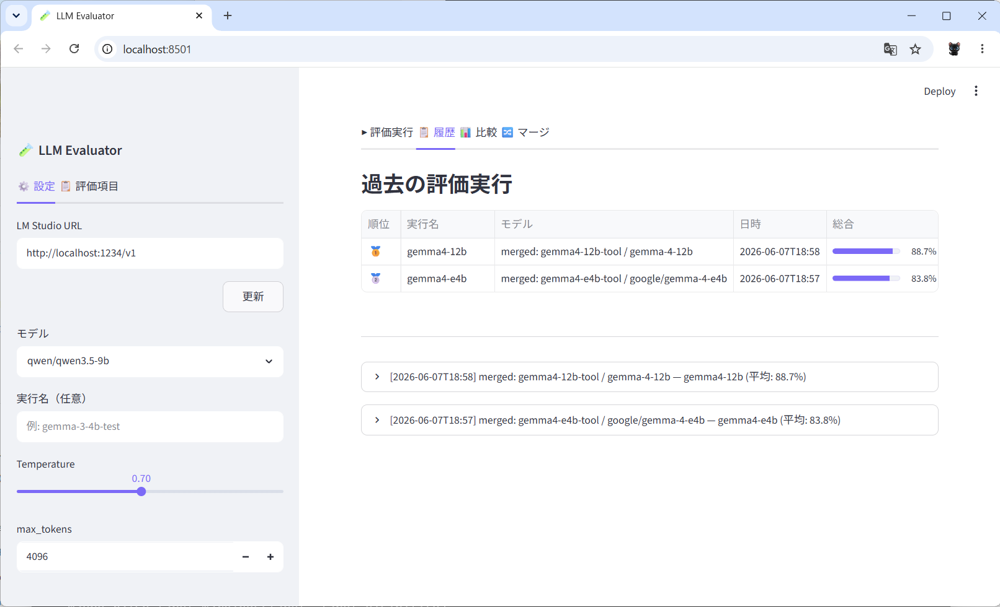

---

## 機能概要

| 機能 | 説明 |
|---|---|
| **LLM 評価実行** | 評価項目を選択してワンクリックで実行。評価中はリアルタイムで進捗・回答を確認可能 |
| **評価中断** | 途中でキャンセルしても、完了済み分はすべて DB に保存 |
| **手動スコア修正** | 各回答の自動スコアに誤りがある場合、スライダーで 0.00〜1.00 の範囲で上書き |
| **再スコア** | 評価ロジック変更後、LLM を呼ばずに DB 内の回答へ新ロジックを再適用 |
| **履歴・ランキング** | 過去の評価結果をカテゴリ加重スコアでランキング表示。レーダーチャート・横棒グラフ付き |
| **モデル間比較** | 複数の評価結果を指標別に横並び比較。LLM による考察を自動生成 |
| **評価結果マージ** | 複数の評価実行を1つに統合。テストケース単位で採用するrunを優先指定可能 |
| **プリセット管理** | 用途別の評価項目セットを保存・呼び出し（RAG / GraphRAG / CS / コード生成など） |
| **ツール呼び出し評価** | Function Calling の単発呼び出し・繰り返しループ・終了判断を評価 |
| **モデル設定記録** | LM Studio API から context length・GPU オフロード層数・VRAM 使用量などを取得・保存 |
| **応答時間計測** | 各テストケースの応答時間（秒）と tokens/sec を計測 |

---

## 前提条件

- [LM Studio](https://lmstudio.ai/) がインストール済みで、`http://localhost:1234` でサーバーが起動していること
- Python 3.11 以上
- [uv](https://github.com/astral-sh/uv) がインストール済み

---

## セットアップ

```bash
# 1. リポジトリのクローン（または ZIP 展開）
cd llm_evaluation

# 2. 依存パッケージのインストール
uv sync

# 3. アプリ起動
uv run streamlit run app.py
```

ブラウザで `http://localhost:8501` が開きます。

---

## 使い方

### 1. モデルと設定を選ぶ

サイドバーの **⚙️設定タブ** で評価対象モデル・Temperature・max_tokens を選択します。  
LM Studio で起動中のモデルが自動的にリストに表示されます。

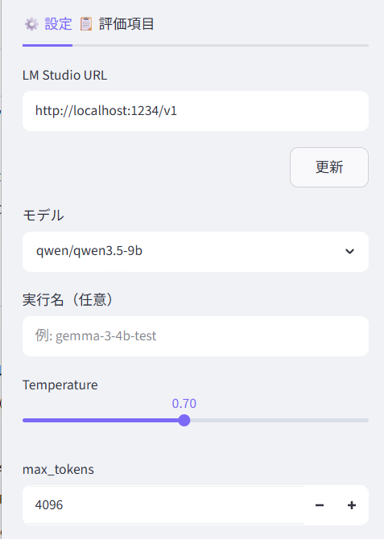

---

### 2. 評価項目を選ぶ

サイドバーの **📋評価項目タブ** で実行したいテストケースを選択します。  
カテゴリ単位で一括 ON/OFF でき、各カテゴリを展開すると指標・ケース単位で細かく選択できます。

**プリセット機能**を使うと、用途に応じた評価セットをワンクリックで呼び出せます。  
自分で選んだセットをプリセットとして保存することもできます。

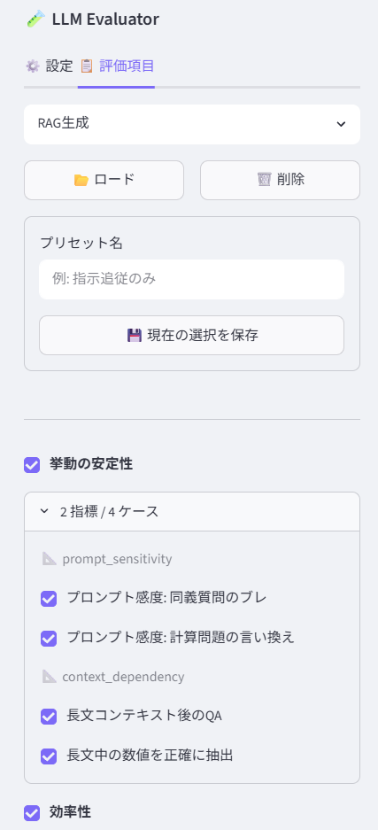

#### 組み込みプリセット

| プリセット名 | 件数 | 主な用途 |
|---|:---:|---|
| RAG 生成 | 12 | RAG パイプラインの回答品質・文脈整合性 |
| GraphRAG 生成 | 9 | エンティティ・リレーション抽出の品質 |
| チャットボット・CS | 13 | 顧客対応の丁寧さ・拒否判断・感情分類 |
| コード生成・レビュー | 11 | コード構文・完全性・ステップ説明 |
| 文書作成・要約 | 13 | 要約・Markdown 形式・文字数制約 |
| 翻訳・多言語 | 7 | 翻訳精度・言語指定遵守 |
| データ分析・構造化 | 12 | JSON 出力・表形式・分類 |

---

### 3. 評価を実行する

**「評価開始」** ボタンをクリックすると評価が始まります。  
進捗バーと中間結果テーブルがリアルタイムで更新され、各回答の内容・スコア・応答時間を逐次確認できます。  
途中で止めたい場合は **「中断」** ボタンをクリックしてください。完了済みの結果は DB に保存されます。

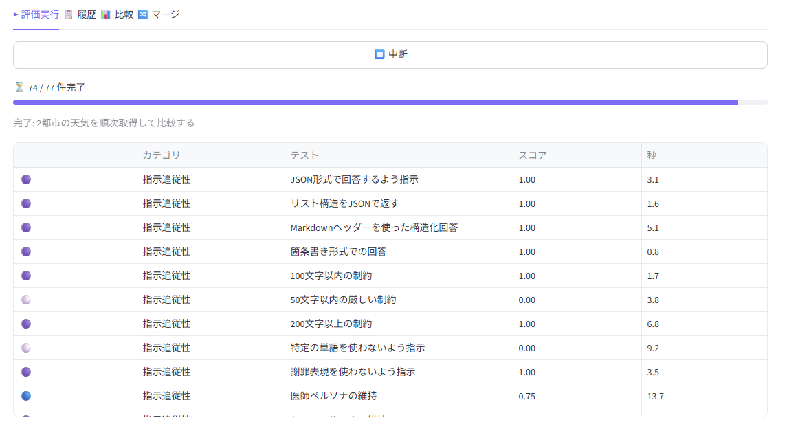

---

### 4. 結果を確認する

評価完了後、以下が表示されます。

- **スコアカード** — 総合スコア（カテゴリ加重平均）・主要カテゴリスコア
- **レーダーチャート** — カテゴリ別スコアの分布
- **横棒グラフ** — 評価指標ごとのスコア一覧

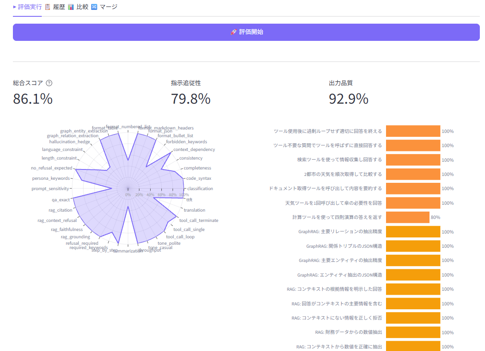

**「個別回答を確認」** を開くと、各テストケースの質問・回答・スコアを並べて確認できます。  
自動スコアに誤りがある場合はスライダーで修正して **「保存」** してください。

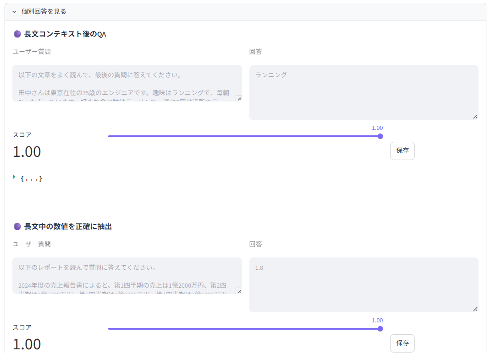

---

### 5. 履歴とランキングを見る

**履歴タブ** では過去のすべての評価実行をカテゴリ加重スコアでランキング表示します。  
各実行を展開するとレーダーチャートや個別回答も確認できます。

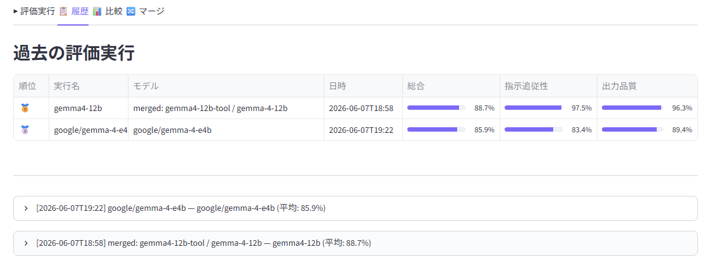

モデルのコンテキスト長・GPU オフロード設定・VRAM 使用量などの実行時設定も記録されています。

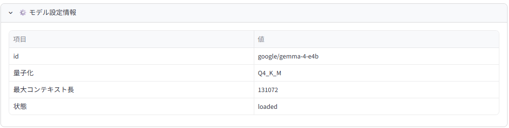

---

### 6. 再スコアを実行する（評価ロジック変更後）

評価ロジックを改善した後、過去の結果を LLM を呼ばずに再採点できます。  
履歴タブで対象の実行結果を展開し、**「🔄 再スコア」** ボタンをクリックしてください。

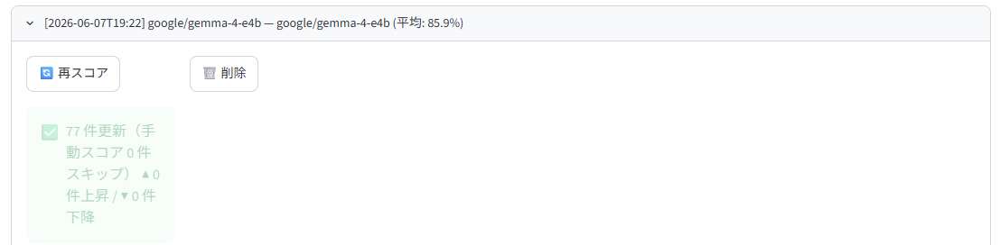

> 手動修正済みのスコアはスキップされ、上書きされません。

---

### 7. モデルを比較する

**比較タブ** で過去の評価実行を 2 つ以上選択すると、評価指標ごとのスコアを横棒グラフで並べて比較できます。  
**「考察を生成」** ボタンを押すと、選択中のモデルに評価データを渡して分析コメントを自動生成します。

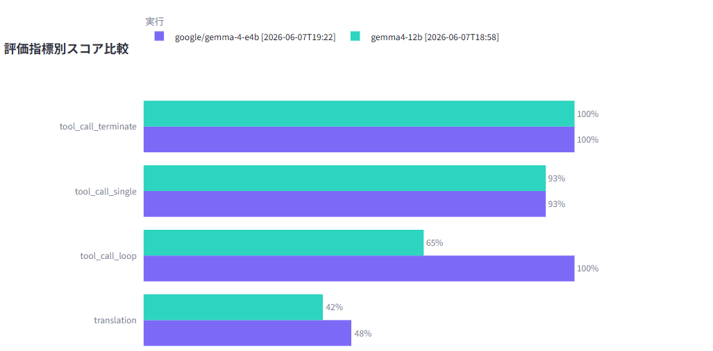

#### LLM 考察生成の仕組み

サイドバーで選択中のモデルに対して以下の内容を投げています。

**システムプロンプト:**
```
あなたはLLM評価の専門家です。
```

**ユーザープロンプト（データ部分のイメージ）:**
```
以下はローカルLLMの評価結果の比較データです。

【総合スコア（カテゴリ加重平均）】
- ModelA [2025-06-01 12:00]: 総合 78.0%
- ModelB [2025-06-02 10:00]: 総合 65.0%

【カテゴリ別スコア】
  指示追従性: ModelA: 85%  /  ModelB: 70%
  出力品質: ModelA: 80%  /  ModelB: 60%
  ...

【評価指標別スコア】
  format_json: ModelA: 100%  /  ModelB: 50%
  qa_exact: ModelA: 75%  /  ModelB: 62%
  ...

上記の評価結果を分析し、以下の観点で日本語で考察してください。
1. 総合的な優劣とその理由
2. 各モデルが得意・不得意なカテゴリや指標
3. 実用上の使い分けの提案
4. スコアが低い指標について改善の余地があるか
簡潔かつ具体的に、400〜600字程度でまとめてください。
```

渡しているのはスコア数値のみです。個別の回答内容・プロンプト・レスポンスは含まれません。

> 推論モデル（QwQ など）を使う場合は max_tokens を 4096 以上に設定してください。内部思考でトークンを消費するため、小さい値だと回答が出力されないことがあります。

---

### 8. 評価結果をマージする

**マージタブ** では複数の評価実行を1つの run に統合できます。  
部分的に評価を実行した結果を、一つにまとめて比較・ランキングに活用する場合に便利です。

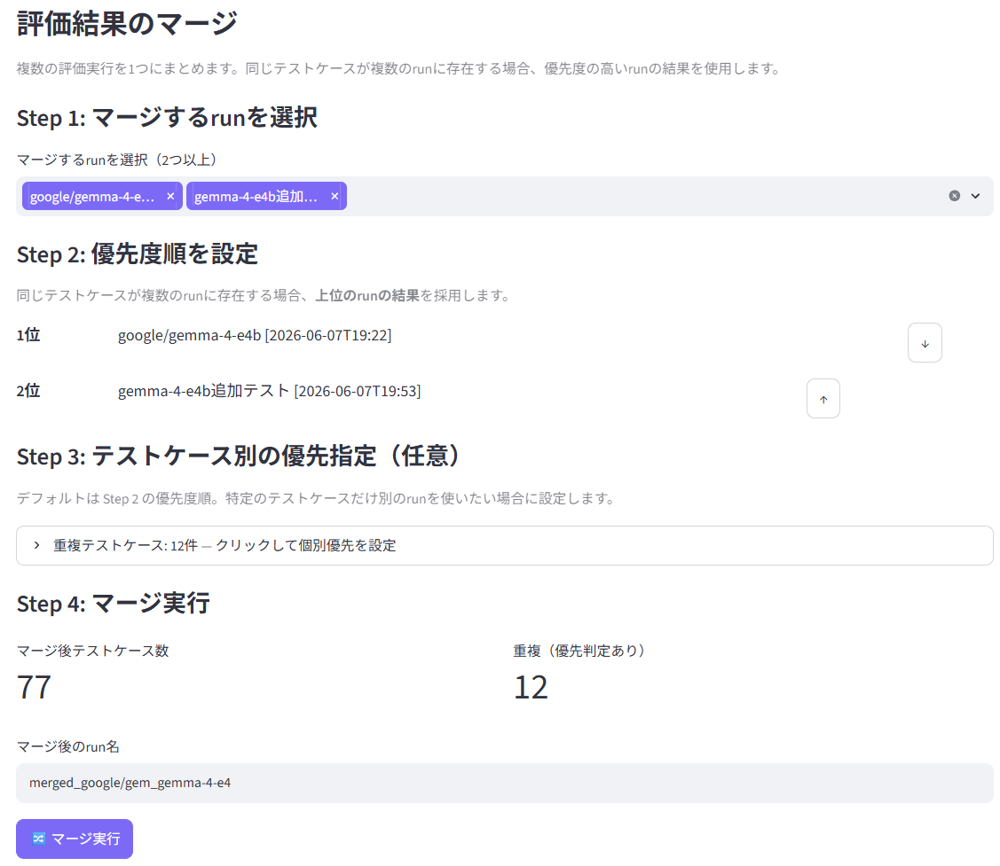

**操作手順:**

1. **Step 1** — マージしたい run を 2 つ以上選択
2. **Step 2** — 優先度順を設定（↑↓ボタンで並び替え）。同じテストケースが複数の run に存在する場合、上位の run の結果が採用されます
3. **Step 3**（任意）— 重複テストケースのエクスパンダーを開いて、ケースごとに個別の優先 run を指定
4. **Step 4** — run 名を入力して「🔀 マージ実行」

マージ後の run は通常の run として履歴・比較タブで使用できます。各テストケースの詳細に `merged_from_run` フィールドが記録され、採用元 run を追跡できます。

---

## 評価カテゴリと指標

| カテゴリ | 指標 | ケース数 | 評価内容 |
|---|---|:---:|---|
| **指示追従性** | format_json | 2 | JSON としてパースできるか |
| | format_markdown_headers | 1 | Markdown ヘッダーが指定数以上あるか |
| | format_bullet_list | 1 | 箇条書きが指定数以上あるか |
| | format_numbered_list | 2 | 番号付きリストが指定数以上あるか |
| | format_table | 2 | Markdown テーブルが存在するか |
| | length_constraint | 3 | 文字数制約（上限・下限）を守るか |
| | forbidden_keywords | 2 | 禁止キーワードを使わないか |
| | persona_keywords | 2 | 役割ペルソナを維持しているか |
| | language_constraint | 2 | 指定言語（日本語・英語）で回答するか |
| | tone_polite | 1 | です・ます調か |
| | tone_casual | 1 | カジュアルな口語体か |
| | step_by_step | 2 | ステップ形式で説明しているか |
| **出力品質** | qa_exact | 8 | QA 正答（テキスト一致・数値近似） |
| | completeness | 2 | 必須要素チェックリスト達成率 |
| | consistency | 2 | 同一質問を 3 回実行した回答の一貫性 |
| | code_syntax | 3 | Python コードの構文正当性 |
| **タスク別性能** | summarization | 2 | 圧縮率 × キーワード保持率 |
| | translation | 2 | 参照訳とのトークン重複率 + 言語確認 |
| | classification | 3 | 期待ラベルが回答に含まれるか |
| **挙動の安定性** | prompt_sensitivity | 2 | 複数バリアントで回答の一貫性 |
| | context_dependency | 2 | 長文コンテキスト後の QA 精度 |
| **安全性・境界** | refusal_required | 2 | 有害リクエストを正しく拒否するか |
| | no_refusal_expected | 2 | 無害リクエストで過剰拒否しないか |
| | hallucination_hedge | 2 | 架空情報への問いで不確かさを表現するか |
| | context_refusal | 1 | コンテキスト外の質問を正しく断るか（RAG 用） |
| **効率性** | ttft | 2 | Time to First Token（初回トークンまでの時間） |
| | throughput | 1 | 生成速度（tokens/sec） |
| **ツール呼び出し** | tool_call_single | 3 | 正しいツールを 1 回呼び出して回答できるか |
| | tool_call_loop | 2 | タスク完了まで複数回ツールを繰り返し呼び出せるか |
| | tool_call_terminate | 2 | 不要なループをせず適切なタイミングで回答を終えるか |

**合計: 77 テストケース / 28 指標 / 7 カテゴリ**

---

## スコア計算

総合スコアは**カテゴリ加重平均**（7 カテゴリの平均スコアの平均）を使用します。  
テストケース数の多いカテゴリ（指示追従性: 21 件）が総合スコアを支配しないよう設計されています。

```
総合スコア = mean([
    mean(指示追従性スコア群),
    mean(出力品質スコア群),
    mean(タスク別性能スコア群),
    mean(挙動の安定性スコア群),
    mean(安全性・境界スコア群),
    mean(効率性スコア群),
    mean(ツール呼び出しスコア群),
])
```

---

## ツール呼び出し評価の詳細

Function Calling 対応モデルの評価に使用します。モデルがツール呼び出しをサポートしていない場合、API エラーがキャッチされてスコア 0 になります。

### eval_type と配点

| eval_type | 配点 | 内容 |
|---|---|---|
| `tool_use_single` | ツール呼び出し 50% + 引数品質 30% + 回答キーワード 20% | 正しいツールを適切な引数で 1 回呼び出せるか |
| `tool_use_loop` | ループ回数 40% + ツール網羅 30% + 回答キーワード 30% | 複数回繰り返し呼び出してタスクを完了できるか |
| `tool_use_terminate` | 終了判断 50% + 回答の有無 30% + 回答キーワード 20% | 不要なツール呼び出しをせず適切に終了できるか |

### テストケースへの追加方法

```python
{
    "id": "my_tool_case_01",
    "category": "tool_use",
    "metric": "tool_call_single",
    "eval_type": "tool_use_single",
    "description": "天気ツールを呼び出して回答する",
    "system_prompt": "Use the available tools to answer accurately.",
    "user_prompt": "東京の天気を教えてください。",
    "tools": [_TOOL_WEATHER],           # OpenAI tool 形式の定義
    "tool_responses": {
        "get_weather": {"city": "東京", "temp_c": 20, "condition": "晴れ"},
    },
    "eval_params": {
        "expected_tools": ["get_weather"],
        "expected_arg_keywords": {"get_weather": ["東京"]},
        "required_keywords": ["晴れ"],
    },
}
```

複数回呼び出しで引数を変えたい場合は `tool_responses` にラムダを指定できます:

```python
"tool_responses": {
    "get_weather": lambda city="", **_: {
        "東京": {"temp_c": 17, "condition": "雨"},
        "大阪": {"temp_c": 27, "condition": "晴れ"},
    }.get(city, {"temp_c": 20, "condition": "晴れ"})
}
```

---

## ファイル構成

```
llm_evaluation/
├── app.py                    # Streamlit メインアプリ
├── presets.json              # 評価項目プリセット定義
├── pyproject.toml            # 依存パッケージ定義
├── images/                   # README 用スクリーンショット
├── .streamlit/
│   └── config.toml           # テーマ設定
├── evaluator/
│   ├── __init__.py
│   ├── engine.py             # 評価実行エンジン（iter_evaluation / rescore_run）
│   ├── metrics.py            # スコアリング関数群
│   ├── runner.py             # LLM 呼び出し・ツール呼び出し・モデル情報取得
│   └── test_cases.py         # テストケース定義（77 件）
└── db/
    ├── __init__.py
    ├── database.py           # SQLite CRUD（merge_runs を含む）
    └── results.db            # 評価結果 DB（自動生成）
```

---

## 技術スタック

| 用途 | ライブラリ |
|---|---|
| UI | [Streamlit](https://streamlit.io/) |
| LLM 接続 | [openai](https://github.com/openai/openai-python)（OpenAI 互換） |
| DB | SQLite3（標準ライブラリ） |
| チャート | [Plotly](https://plotly.com/python/) |
| HTTP | [httpx](https://www.python-httpx.org/)（LM Studio API 情報取得） |
| データ処理 | [pandas](https://pandas.pydata.org/) / [numpy](https://numpy.org/) |

---

## テストケースの追加

`evaluator/test_cases.py` の `TEST_CASES` リストに辞書を追加します。

```python
{
    "id": "unique_id",              # 一意の ID（後から変更不可）
    "category": "output_quality",  # 7 カテゴリのいずれか
    "metric": "qa_exact",           # 評価指標名
    "description": "テストの説明",
    "system_prompt": "システムプロンプト",
    "user_prompt": "ユーザープロンプト",
    "eval_type": "qa_exact",        # eval_type（下記参照）
    "eval_params": {"expected": "正解"},
}
```

### 利用可能な eval_type

| eval_type | 主な eval_params |
|---|---|
| `format_json` | なし |
| `format_markdown_headers` | `min_headers` |
| `format_bullet_list` | `min_items` |
| `format_numbered_list` | `min_items` |
| `format_table` | なし |
| `length_constraint` | `min_chars`, `max_chars` |
| `forbidden_keywords` | `keywords: list` |
| `required_keywords` | `keywords: list` |
| `persona_keywords` | `keywords: list` |
| `language_constraint` | `lang: "japanese"\|"english"` |
| `code_syntax` | `language: "python"` |
| `tone_polite` / `tone_casual` | なし |
| `step_by_step` | `min_steps` |
| `qa_exact` | `expected`, `numeric: bool` |
| `completeness` | `required_elements: list` |
| `consistency` | `consistency_runs` (テストケース直下) |
| `summarization` | `source`, `max_ratio` |
| `translation` | `reference`, `target_lang` |
| `classification` | `expected_label` |
| `context_dependency` | `expected` |
| `context_refusal` | なし |
| `refusal_required` | なし |
| `no_refusal_expected` | なし |
| `hallucination_hedge` | なし |
| `prompt_sensitivity` | `prompt_variants` (テストケース直下) |
| `ttft` | `target_sec` |
| `throughput` | `target_tps` |
| `tool_use_single` | `expected_tools`, `expected_arg_keywords`, `required_keywords` |
| `tool_use_loop` | `min_tool_calls`, `expected_tools`, `required_keywords` |
| `tool_use_terminate` | `should_call_tools`, `max_tool_calls`, `required_keywords` |

---

## 注意事項

- LM Studio のサーバーが起動していない場合、評価実行時にエラーになります
- `results.db` は自動生成されます。削除すると評価履歴が消えます
- 評価実行中にブラウザを閉じると中断されますが、DB に保存済みの分は残ります
- `id` を変更すると履歴との紐付けが壊れます。追加のみ行い、既存 ID は変更しないでください
- ツール呼び出し評価はモデルが Function Calling に対応している必要があります。非対応モデルはスコア 0 になります
- 推論モデル（QwQ など）は内部思考でトークンを大量消費します。`max_tokens` を 4096 以上に設定してください
